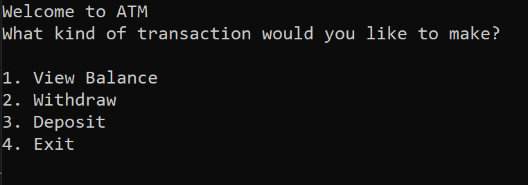
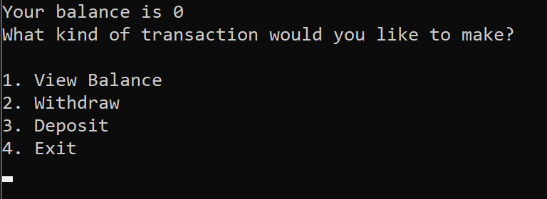
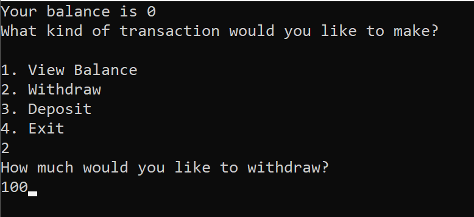
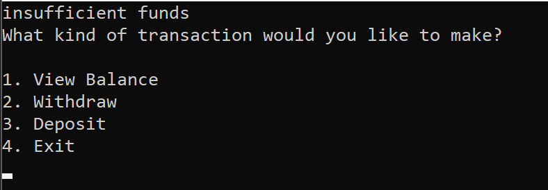
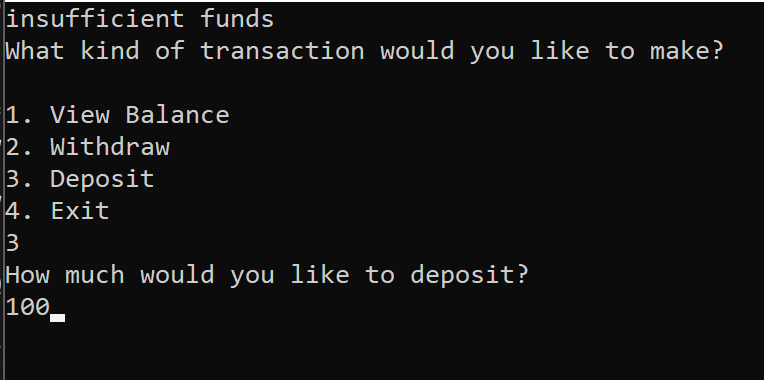
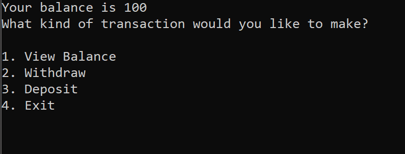
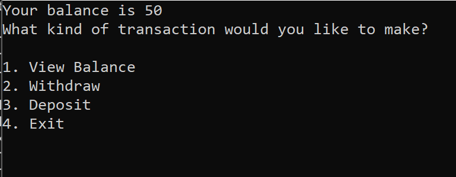

# Lab02-UnitTesting
C# ATM program that uses try/catch/finally as well as xUnit.net for unit testing

## How to Use it
Upon starting this application the user has a balance of $0 
and has four options to choose from in order to progress through the program. 
They can View their balance, Withdraw money, Deposit money, and Exit (closing the application).

The user can either enter the command they want or its corresponding number.
All other inputs should be integers.

## Walkthrough

#### The balance begins at $0.00 so we will make a withdraw, because whop doesn't love free money?!

#### This lets the user know they do not have the funds to make the withdraw. Okay! Lets make a deposit then.

#### Here's the Deposit.

#### The balance is now $100 woot! 

#### Lets make a withdraw now.

#### Finally we have a balance of $50.00 

#### Lastly hit 4 and Exit
Final note, if any key is pressed that is not a number for the type of transaction, the menu will be called and the user will be able to continue to use the ATM without altering any of the data.